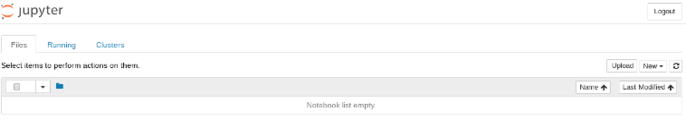
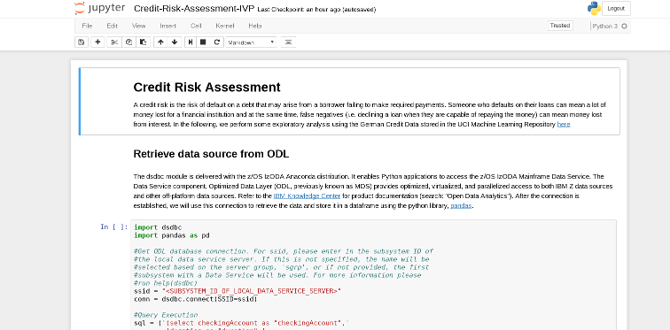

# Anaconda/ODL Installation Verification Program (IVP) with Jupyter Notebook

## Jupyter Kernel Gateway with NB2KG 
To execute and run a Jupyter Notebook server, the current solution is to use our Jupyter Kernelgateway(JKG) on z/OS and [NB2KG's](https://github.com/jupyter/nb2kg#jupyter-notebook-extension-to-kernel-gateway-nb2kg) install process on x86.

In general, we highly recommend users creating their own Conda Environments. This allows each user to have full access to the packages they intend to use. 

To create a conda environment you can use the following command

```
conda create -n <environment name> python
```

This will create a new environment with python and its dependencies in ~/.conda/envs. This environment can then be activated with one of the following commands
```
source activate <environment name>
```
Or
```
conda activate <environment name>
```

You can confirm the environment has been activated with one of two ways, if you run `conda info –envs` all of your environments will be listed, and the current active one will have a “*” next to it. Or if you look at your shell you will see your environments name in parenthesis preceding your input.

Once you have your environment activated we will need to install a few packages through the conda package manager, mainly the dependencies for creating a python kernel and running JKG or JEG. The command to perform any install with conda is `conda install`. So in this case lets do
```
conda install jupyter-kernel-gateway
```

From here we will need to create a python 3 kernel for jupyter to use. This can be accomplished with the following command
```
python -m ipykernel install –user
```

After this point you should configure JKG. You can generate a config file with the following command
```
jupyter kernelgateway --generate-config
```
There are a few values that will need to be edited and uncommented. 
They are the following
```
#c.KernelGatewayApp.allow_origin = '*'
#c.JupyterWebsocketPersonality.list_kernels = True
#c.KernelGatewayApp.ip = '<ip>'
#c.KernelGatewayApp.port = <port>
```

This will conclude the configuration on z/OS and you should move onto configuring NB2KG on an x86 system. It’s instructions can be found in the NB2KG link above or [here](https://github.com/jupyter/nb2kg#jupyter-notebook-extension-to-kernel-gateway-nb2kg).

When both sides of the solution are setup, you should be able to start up jupyter kernel gateway using the following command:
```
jupyter kernelgateway
```

Note: This is if the optional jupyter_kernel_gateway_config.py is setup. If not please run with --ip and --port options.
And you should also be able to start up the notebook server on x86 in the container via the following run command:
```
./start.sh <optional-config-file>
```

You will know the setup is successful if you see the jupyter notebook dashboard in your web browser:



Then if you click on the drop-down menu "New" you should see Python 3 as one of the options for creating a new notebook.

## Running Jupyter Notebook

For running the Jupyter Notebook, you will need to upload our Jupyter Notebook into your Jupyter Notebook server. In order to upload, please download [Credit-Risk-Assessment-IVP.ipynb](https://github.com/IzODA/examples/tree/master/python) to your local machine. When you have finished downloading, click the "Upload" button in your Jupyter Notebook dashboard and find the .ipynb file you just downloaded. Then hit "Open". At this point you should see the notebook in your dashboard with the option to "Upload" next to the file name. Please click "Upload". Run the Jupyter Notebook by clicking on the .ipynb file. A new window should pop open and you'll see something like the following:



Notice in the top right hand corner, it says the kernel you are using, in our case, Python 3. Also notice, the open circle that is next to the kernel name, this is telling us that the connection is established and the kernel is ready to execute code written in the Jupyter notebook cells (the different cells are denoted with "In []:" next to it) In our IVP notebook, there are two different types of cells, Markdown and code cells. Markdown cells include documentation for our IVP and code cells include python code to be executed by the jupyter kernel, ipython. To start executing code, click on a cell and go to *Cell > Run Cells* (or use the shortcut keys Shift + Enter). The execution is done when you see a number in "In []:" i.e. "In [1]:" next to the cell. The number corresponds to the order the cell was run in. (Order matters! Please run the notebook from top to bottom or you can run all cells by going to *Cell > Run All*). If there is a * within the brackets i.e. "In [*]:" that means the code is still executing. Note also that some of the code cells will produce output that will appear directly underneath the cell.

The Jupyter Notebook is split into three sections:

- Retrieve Data Source from ODL
- Data Analysis with Pandas
- Visualization with Matplotlib

If all the code cells run successfully, you can ensure Anaconda has been installed properly. At this point, you should have a good understanding of how to use Jupyter Notebooks to perform data analysis/machine learning on mainframe data sources.

Authors: Yunli Tang, Joe Bostian    Date: September 5th, 2017
