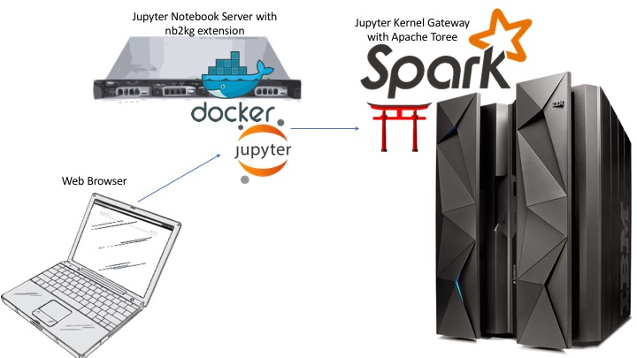

<h1>Jupyter with Remote Notebook on the Mainframe</h1>

When <a href="http://spark.apache.org/releases/spark-release-2-0-0.html" target="_blank" rel="noopener noreferrer">Spark 2.0</a> was released to the public, it presented a major problem for people who use it in the mainframe environment. Spark 2.0 fully incorporates <a href="https://databricks.com/blog/2015/04/28/project-tungsten-bringing-spark-closer-to-bare-metal.html" target="_blank" rel="noopener noreferrer">Project Tungsten</a>, a key initiative that focuses on improving memory and CPU efficiency. One of the main features of Project Tungsten is to operate directly against binary data in order to eliminate the overhead of JVM objects and garbage collection. This new feature, however, introduced byte-order dependencies and caused issues to Spark applications running in a mixed-endian environment. For example, a Spark driver running inside a <a href="http://jupyter.org/" target="_blank" rel="noopener noreferrer">Jupyter Notebook</a> on x86 (little-endian) talking to a Spark cluster running on z/OS (big-endian) would encounter some nasty data integrity problem.

The easiest solution to this mixed-endian data integrity problem is to avoid running your Spark driver on a little-endian platform. But there are many compelling reasons to have a remote application - security, scalability, accessibility to name a few. Luckily the Jupyter Notebook extension, <a href="https://github.com/jupyter-incubator/nb2kg" target="_blank" rel="noopener noreferrer">nb2kg</a>, discussed below provides a solution that circumvents the byte-order issue even in a mixed-endian environment.

###Jupyter Kernel Gateway on the Mainframe

What is <a href="https://jupyter-kernel-gateway.readthedocs.io/en/latest/" target="_blank" rel="noopener noreferrer">Jupyter Kernel Gateway?</a> Jupyter Kernel Gateway has several capabilities, but one of these capabilities is to offer Jupyter Notebook kernels to remote hosts. The kernels will run on the mainframe but can be executed by an x86 system.

The diagram above shows how this process works. An end user would connect to a Jupyter Notebook Server with the nb2kg extension, in this case running as a <a href="https://www.docker.com/" target="_blank" rel="noopener noreferrer">Docker</a> container. The nb2kg extension would connect to a Jupyter Kernel Gateway Server and would request access to the kernels it hosts. The Jupyter Kernel Gateway Server, which in this case runs on z/OS, would offer the kernels it hosts to the Jupyter Notebook Server that requested them, and then would run any notebooks on platform. In this reference architecture, one of the kernels the Jupyter Kernel Gateway Server would be offering is the Apache Toree kernel which offers the user an Apache Spark, Scala, Notebook environment to run under. Because the Apache Toree kernel is running on z/OS, there are no byte order issues.

##Setup Jupyter Notebook to Kernel Gateway w/ Apache Toree Environment

###Setup the Kernel Gateway and Apache Toree on z/OS

Given that this example revolves around the mainframe, a lot of the work will be done on a z/OS host. To install and run the Jupyter Kernel Gateway with Apache Toree solution on z/OS follow these <a href="https://www.anaconda.org/izoda/JKG2AT" target="_blank" rel="noopener noreferrer">instructions.</a>

###Setup the Jupyter Notebook Server with nb2kg Extension

Now that you have the Jupyter Kernel Gateway Server running on z/OS, you now need to setup the Jupyter Notebook Server with nb2kg extension. There are a few ways to set this up, and choosing one depends on your environment. If you wish to run the Jupyter Notebook Server on a Linux on z LPAR, follow <a href="#" target="_blank" rel="noopener noreferrer">these instructions.</a> If you wish to run the Jupyter Notebook Server on an x86 Linux system, follow <a href="https://github.com/jupyter-incubator/nb2kg" target="_blank" rel="noopener noreferrer">these instructions.</a>

Authors: David Rice, Jessie Yu    Date: April 5th, 2017
