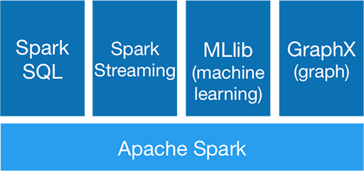
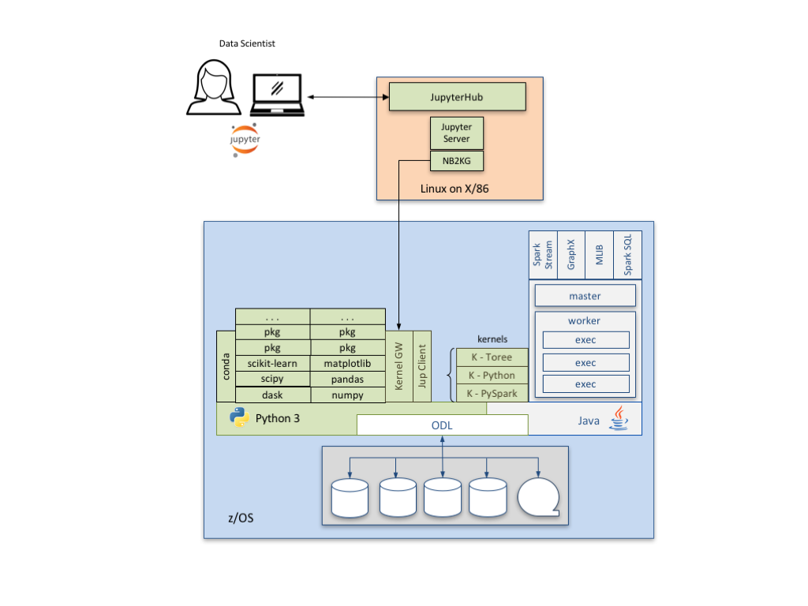

# Apache Spark

[Apache Spark](https://spark.apache.org/) is a general purpose, high performance clustering analytics engine that allocates resources and distributes work across a set of processes and tasks. It is organized as a set core functions that underpin a collection of functional libraries.

Spark was originally released through the IBM z/OS Platform for Apache Spark offering in March of 2016.

## Spark and Anaconda

Apache Spark has no dependencies on Anaconda. However, Anaconda's package management capabilities have allowed for all of Spark's dependencies to be included in the IzODA Anaconda package library. This means that IzODA is a self-contained offering with no pre-requisites other than z/OS and Java at the proper service levels. It also means that Spark and Anaconda are effectively co-requisites, and should always be installed along with the ODL (MDS) FMID.

Along with Spark's pre-requisites, those parts of the Jupyter ecosystem that run on z/OS can now be installed via conda from the [JKG2AT package.](https://anaconda.org/izoda/jkg2at) Setup information about JKG2AT can be [found here.](jupyter-remote-notebook/)

## Installation and Customization

Refer to the [IBM Knowledge Center](https://www.ibm.com/support/knowledgecenter/) for installation and customization instructions. The guides can be downloaded via [PDF or TOC here.](https://www.ibm.com/support/knowledgecenter/SS3H8V_1.1.0/com.ibm.izoda.v1r1.izodalp/izoda.htm) Further instructions about how to install and customize Apache Spark are in chapters 2 and 3 of the [IzODA Installation and Customization Guide.](https://www-304.ibm.com/servers/resourcelink/svc00100.nsf/pages/izodav110sc279033/$file/azk1a100.pdf)

## Verify Your Installation

We have created a collection of small sample applications which you can run to verify that Spark is installed and configured properly, and works with the other components of IzODA. Please choose one of the Install Verification Programs (IVPs) from the [IBM Knowledge Center.](https://www.ibm.com/support/knowledgecenter/en/SS3H8V_1.1.0/com.ibm.izoda.v1r1.azka100/topics/azkic_c_partverify.htm)

## Reference Material

A library of documentation is available for the IBM Open Data Analytics for z/OS offering. This can be found at the [IBM Knowledge Center.](https://www.ibm.com/support/knowledgecenter/)

The [Apache Spark Implementation on IBM z/OS](http://www.redbooks.ibm.com/abstracts/sg248325.html) is another good source of information about both Spark and ODL.
