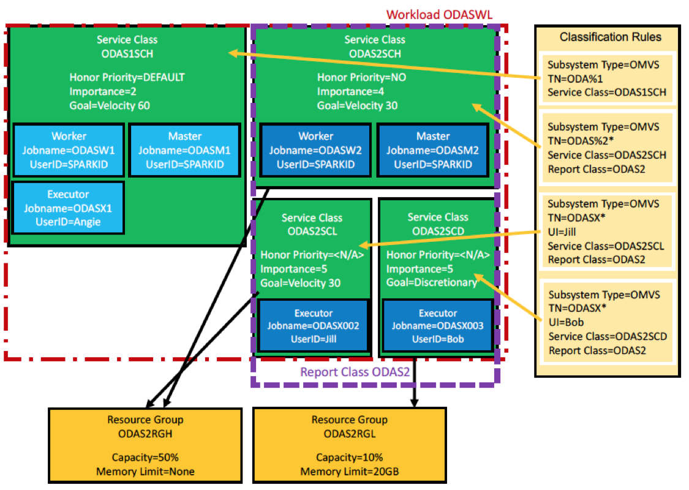
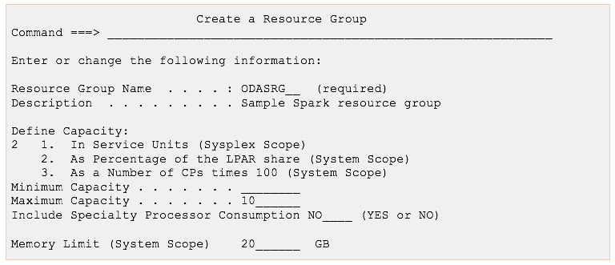

<h1>WLM Metering and Capping for IzODA Spark</h1>

##Introduction

   One of the strengths of the z Systems platform and the z/OS operating system is the option to run multiple workloads at the same time within one z/OS image or across a Parallel Sysplex. Workloads usually have different, often competing, performance and resource requirements that must be balanced to make the best use of an installation's resources, maintain the highest possible throughput, and achieve the best possible system responsiveness. The function that makes this possible is dynamic workload management, which is implemented in the workload management component of z/OS.

   With z/OS workload management (WLM), you define performance goals and assign a business importance to each goal. You define the goals for work in business terms, and the system decides how much resource, such as CPU or memory, to assign so as to meet the goal. WLM constantly monitors the system and adapts processing to meet the goals.

   In October 2016, IBM announced the intent to stage support for new capabilities in z/OS for metering and capping workloads over CPU and memory consumption. This support provides additional WLM controls that enable the system capacity planner to specify that the resource consumption of selected workloads should not exceed the specified limits. You can, for example, use WLM to ensure that all the applications or jobs submitted to a Spark cluster do not consume more than a specified real memory limit, and that they do not receive help from standard processors when the zIIP capacity is exceeded.

   This paper provides an overview of using WLM Metering and Capping for IBM Open Data Analytics for z/OS Spark (IzODA Spark, FMID HSPK120), and its associated considerations.

   <strong>Note:</strong> The IBM.Function.MemoryCapping fix category and the MEMCAP/K keyword in RETAIN identify the PTFs that enable the Metering and Capping functions.

##Overview of Apache Spark processes

   IzODA Spark is built on Apache Spark, which uses a master/worker architecture. A Spark cluster typically has multiple processes, each running in its own Java virtual machine (JVM).

   The following list describes the most significant processes:
   <ul>
       <li>The <em>master</em> daemon allocates resources across applications.</li>
       <li>The <em>worker</em> daemon monitors and reports resource availability and, when directed by the master, spawns executors. The worker also monitors the liveness and resource consumption of the executors.</li>
       <li>The <em>executor</em> performs the actual computation and data processing for the application.</li>
       <li>The <em>driver</em> program runs the main function of the application and creates a <em>SparkContext</em>.</li>
  </ul>
   The master and worker processes are generally lightweight. By contrast, the executors attempt to use all available system resources by default. You can use the spark-defaults.conf file, spark-env.sh file, and command line parameters to constrain the number of CPU cores and amount of memory that each executor can consume. These parameters, however, are static and require that the Spark processes be restarted for changes to take effect. (For more information about the Apache Spark configuration options, see <a href="https://spark.apache.org/docs/2.1.1/configuration.html" target="_blank">Spark Configuration.</a> For more information about tuning the Apache Spark cluster, see <a href="https://spark.apache.org/docs/2.1.1/tuning.html" target="_blank">Tuning Spark.</a>

   WLM provides a more dynamic way to manage the performance of your Spark workloads.

##Overview of WLM classification for IzODA Spark

   You specify goals for the WLM services for IzODA Spark work in the same manner as for other z/OS workloads, by associating the work with a service class. In the service class, you assign goals to the work, along with the relative importance of each goal. You can also assign limits for CPU and memory capacity to be available to a service class. To associate incoming work with a particular service class, you must also define classification rules.

   WLM uses classification rules to map work coming into the system to a specific service class and report class. The classification is based on work qualifiers. The first qualifier is the subsystem type that receives the work request. The subsystem type for work that is processed in z/OS UNIX (which IzODA Spark workloads are) is OMVS. You can then use the Spark process job names and/or user IDs as the secondary qualifiers to classify your Spark work. Based on your service (PTF) level, there are different ways to assign job names to your Spark processes.

   For more information about configuring WLM for IzODA Spark, see “Configuring z/OS workload manager for Apache Spark” in <a href="https://www.ibm.com/support/knowledgecenter/SS3H8V_1.1.0/com.ibm.izoda.v1r1.azka100/toc.html" target="_blank">IBM Open Data Analytics for z/OS Installation and Customization Guide.</a>

   
   Figure 1. Example of WLM classification configuration

   Figure 1 shows a sample WLM configuration. In this example, 4 service classes are defined: ODAS1SCH, ODAS2SCH, ODAS2SCL, and ODAS2SCD.
   <ul>
       <li>The ODAS2SCH and ODAS2SCL service classes are associated with the ODAS2RGH resource group, which allows 50 percent General Processor (GP) capacity and has no memory limit.</li>
       <li>The ODAS2SCD service class is associated with the ODAS2RGL resource group, which allows only 10 percent GP capacity and has a memory limit of 20 GB.</li>
  </ul>
   Four classification rules are defined that classify work as follows:
   <ul>
       <li>All processes in Spark cluster 1, whose names match the ODAS%1 pattern, are classified into the ODAS1SCH service class.</li>
       <li>Master and worker processes in Spark cluster 2, whose names match the ODAS%2* pattern, are classified into the ODAS2SCH service class.</li>
       <li>The executor for user Jill in Spark cluster 2 has a job name of ODASX002 and is classified into the ODAS2SCL service class.</li>
       <li>The executor for user Bob in Spark cluster 2 has a job name of ODASX003 and is classified into the ODAS2SCD service class.</li>
   </ul>

##Considerations for using WLM Metering and Capping
####Specifying Memory Limit for a resource group

   A WLM resource group is a way of limiting or guaranteeing the system resource availability to one or more service classes. WLM APAR OA52611 provides the ability to limit the physical memory, at a system level, consumed by all address spaces that belong to a resource group.

   <strong>Example:</strong> The following figure shows an example of creating a resource group called ODASRG with a maximum capacity of 10 percent of the LPAR share in the general processor pool and a memory limit of 20 GB:

   
   Figure 2. Example of creating a resource group

   If the physical memory consumption by address spaces associated with a resource group is at or near its memory limit, the system may take action against the address spaces. For instance, the system might initiate paging (within the address spaces associated with the resource group), suspend storage requesters, or, in certain situations, abnormally end (ABEND) entire address spaces. It is therefore a good practice to use the memory limit attribute as an upper limit so that, under normal conditions, resource consumption will operate well below the limit.

   Spark executors are generally good candidates to have their physical memory usage capped, since they typically consume a lot of memory. However, you might see performance degradation or even termination of your Spark applications if they reach their memory limit. In the case of termination, Spark applications usually observe an ABEND SEC6. Another situation that may occur is if an executor is not executing or responding for an extended period of time, such as in a heavy paging situation initiated by approaching a resource group’s memory limit, the executor may be declared lost by the driver. This may prompt the spawning of a new replacement executor, and it becomes possible to have two or more executors running in the same resource group performing the same computation. In a highly competitive resource situation, the driver may declare that it cannot finish successfully and terminates.

   To ensure that the Spark cluster stays alive even if the system terminates executors, we recommend that you avoid placing the Spark master and worker daemons in a memory-limited resource group. We also recommend that you consider your Spark configuration when using WLM to limit resources available to Spark processes. The SPARK_WORKER_MEMORY parameter, for example, should be set to a value less than or equal to the memory limit defined for the executors' resource group. Setting appropriate values for these parameters helps Spark to dispatch work within its limits and help reduce unintended consequences. For more information about the Apache Spark configuration options for standalone mode, see <a href="https://spark.apache.org/docs/2.1.1/spark-standalone.html" target="_blank">Spark Standalone Mode.</a>

####Specifying Honor Priority for a service class

   WLM APAR OA52611 also provides the ability to exclude a service class from the system-wide honor priority defaults. By setting the honor priority attribute to NO on a service class, work in that service class that is eligible to run on specialty processors (such as zIIPs) does not overflow to general-purpose CPs (GPs) when there is insufficient capacity on the specialty processors. The default is to use the IFAHONORPRIORITY and IIPHONORPRIORITY parameters that are specified in the IEAOPTxx member of parmlib.
   You can set the honor priority attribute to NO if you want to minimize the amount of Spark work processed by the GPs. However, give careful consideration to setting honor priority attributes to NO on service classes, especially in the case of highly utilized specialty processors. For instance, a Spark service class restricted to zIIPs may consume much of the zIIP capacity and cause other zIIP-eligible workloads, such as IBM DB2, to overflow to GPs. In addition, Spark applications, by default, fall into the default OMVS service class. If the default OMVS service class is restricted to specialty engines, other processes in the same service class, such as terminals or ssh sessions, might become unresponsive. Spark applications might also experience timeouts during driver and executor communication if they are waiting for CPU time for too long. Monitor these timeouts and adjust the timeout values in the Spark configuration accordingly.

   As with memory limit, we recommend you consider your Spark configuration when using WLM to limit resources available to Spark processes. The SPARK_WORKER_CORES parameter, for example, should be set to a value less than or equal to the number of processors available to the Spark executors after WLM-imposed limits.

   Setting the honor priority attribute to NO might also change the goals for your workload. For instance, if a Spark service class has high velocity goals and is set to use only zIIPs, these two settings might interfere with each other under certain conditions and cause an undesired state for the Spark applications and their workload priorities.

   See the WLM APAR OA52611 text for more information on the WLM Metering and Capping support.

Authors: Jessie Yu (jessieyu@us.ibm.com), Michael Gildein (megildei@us.ibm.com), Kevin Carr (kgcarr@us.ibm.com).    Date: November 27th, 2017
